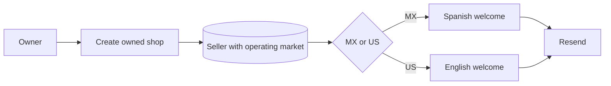

# Pitch — Shop-created welcome by market

Moves · Tests: not grounded — no `Roadmap/00-strategy/` yet.

## The ask, as given

> ah i just realized we dont have an email for when a shop is created outlining the key features they have now right? lets do one in english and one in spanish please as well, pull them up in resend so i can see them. of course each should be sent according to the market on whioch the shop was opened

### Claims

1. A newly created owned shop needs a welcome email that explains its useful features.
2. Provide English and Spanish versions in Resend for review.
3. Send the version corresponding to the shop's opening market.

**Teach-back:** not separately answered — a new owner receives a practical shop welcome in the language of the shop's persisted market, with both versions visible as Resend drafts.

## Problem

The account welcome addresses buyers and possible sellers, while the claim welcome addresses ownership transfer. A merchant who opens a new shop gets neither a tailored introduction to their shop tools nor its public link.

## Appetite

S — one fixed-scope transactional welcome in two market-specific versions, using the existing email transport. No sequence or new delivery infrastructure.

quote: $5–40 (S, n=0, wide)

## Outcome & signal

A new MX shop owner receives Spanish copy; a new US shop owner receives English copy. Both can open their own shop page or dashboard and understand the first actions available. The owner can inspect two unpublished Resend review Templates.

## Stage-2.5 bucket

**Light enhancement.** Email transport, copy blocks, notification catalog, seller email lookup, and shop creation are present. The missing piece is a market-aware send at the actual creation seams.

## Bill of materials (What / Why)

| What | Why |
|---|---|
| Two concise market-specific welcomes | Give a new owner their shop link and a clear first step. |
| Creation-only send from both owner-created paths | Cover direct shop setup and the first-listing shortcut without duplicate sends. |
| Persisted-market decision | Prevent browser locale or stale request data from choosing the wrong language. |
| Two Resend review drafts | Let the product owner see and edit the proposed presentation. |

## Scope

**In v1:** MX Spanish and US English shop-created welcomes, real sender wiring, catalog sample entries, two unpublished Resend drafts, and targeted regression specs.

**Out of v1 (no-gos):** Claim welcome changes, account welcome changes, promoter-created unclaimed shops, campaigns, new flags, and database migrations.

## Rabbit holes

- `POST /api/sell/shop` and `POST /api/sell/create` can both create an owned seller; the latter creates one on first listing. Both must send only on the new-seller branch.
- Medusa stores the operating market in `seller.metadata.operating_market`. Unknown metadata must be reported as unavailable rather than guessed from the URL, locale, or request.
- Resend Dashboard Templates are review copies; the live app currently sends HTML from `lib/email.ts`.

## What already exists (reuse, don't rebuild)

- `apps/miyagisanchez/lib/email.ts` — transport, HTML design, and idempotency option.
- `apps/miyagisanchez/lib/ensure-shop.ts` and `app/api/sell/create/route.ts` — the two owner-created seller paths.
- `apps/backend/src/api/store/sellers/me/route.ts` — stamps the persisted market on creation and returns it.
- `apps/miyagisanchez/lib/notifications/{catalog,fixtures}.ts` — admin sample entry points.

## Visuals

## UX heuristics & rails check

- **CI guards covering this surface:** TypeScript, targeted ESLint, Playwright API specs, and build.
- **Audits-lens findings that apply:** None specific to this transactional email.
- **Design-language debt:** Reuse the existing text-first email design and support Reply-To.

## Acceptance criteria

- **As a new MX or US shop owner, I want** an email in the market's default language with my shop name, shop link, first actions, and dashboard CTA, **so that** I can begin using the shop. **Risk:** low. **QA:** pure market-decision spec observed red on a deliberate wrong-market mutation, then green; check both creation paths.
- **As the product owner, I want** both versions as Resend drafts, **so that** I can review wording and appearance. **Risk:** low. **QA:** read back both draft IDs, status, sample variables, and action links via the Resend CLI.

## Open risks / research

- Recipient lookup or provider delivery can fail after the seller has been created. The send reports a named failure and leaves the shop intact; retries require a separate delivery project if failures appear in use.
